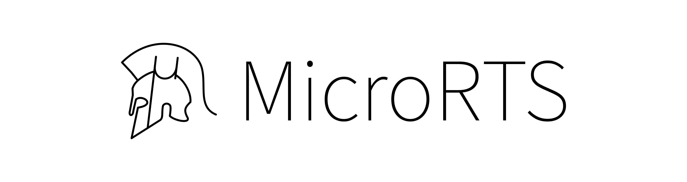

# Dissertation thesis projects
This project is part of a series of 3 projects, available at:   
[1] [https://github.com/MariusVladDumitru/MicroRTS](https://github.com/MariusVladDumitru/MicroRTS) - fork of MicroRTS.  
[2] [https://github.com/MariusVladDumitru/MicroRTS-Python](https://github.com/MariusVladDumitru/MicroRTS-Python) - python api for the above fork of MicroRTS.  
[3] [https://github.com/MariusVladDumitru/BIOSINF-Dissertation](https://github.com/MariusVladDumitru/BIOSINF-Dissertation) - dissertation thesis code.

These projects are the source code for my dissertation thesis.

Thank you to the original authors of MicroRTS, available at [https://github.com/Farama-Foundation/MicroRTS](https://github.com/Farama-Foundation/MicroRTS).  
Thank you to the original authors of MicroRTS-py, available at [https://github.com/Farama-Foundation/MicroRTS-py](https://github.com/Farama-Foundation/MicroRTS-py).  
Thank you to the original authors of python-microRTS, available at [https://github.com/Bam4d/python-microRTS](https://github.com/Bam4d/python-microRTS), documentation available at [https://douglasrizzo.com.br/python-microRTS/index.html](https://douglasrizzo.com.br/python-microRTS/index.html).  

# Wiki
[Project Documentation](https://github.com/MariusVladDumitru/MicroRTS/wiki) 

# Tools
- Bash or cmd
- Java JDK
- Python

# Setup
- Install a text editor or IDE of your choice. Recommandations: [Intellij IDEA](https://www.jetbrains.com/idea/), [NetBeans](https://netbeans.apache.org/front/main/index.html), [Visual Studio Code](https://code.visualstudio.com/), [Sublime Text](https://www.sublimetext.com/), [Notepad++](https://notepad-plus-plus.org/), [Kate](https://kate-editor.org/).
- Install Miniconda or Anaconda available [here](https://www.anaconda.com/download/). Documentation: [Conda documentation](https://docs.conda.io/projects/conda/en/latest/index.html), [Getting Started Guide](https://docs.conda.io/projects/conda/en/latest/user-guide/getting-started.html).  
- Create new conda environment: 
```shell
conda create -n MicroRTS
```
- Activate the new environment: 
```shell
conda activate MicroRTS
```
- Clone this repository: 
```shell
git clone https://github.com/MariusVladDumitru/MicroRTS.git
```
- cd into MicroRTS/Scripts: 
```shell
cd MicroRTS/scripts
```
- Install packages from requirements.txt: 
```shell
conda install --yes --file MicroRTS.py_requirements.txt
```
***CHECK IF THIS WORKS***

- Install JAVA JDK from [https://www.oracle.com/java/technologies/downloads/](https://www.oracle.com/java/technologies/downloads/). Either use the installer or extract the archive.

- For Windows ***Setup.bat***, for Linux ***Setup.sh***:
    - Edit Setup.bat/Setup.sh, go to line 11 and add the absolute path of the Java JDK you installed previously to the JAVA_HOME variable ```JAVA_HOME=<ABSOLUTE_PATH_TO_JAVA_JDK>```.

- Run ```MicroRTS.py setup```:
```shell
python MicroRTS.py setup
```

# How to use MicroRTS
- MicroRTS gane is managed by ```MicroRTS.py``` script located at ```<PROJECT_ROOT>/scripts/MicroRTS.py```.
- ```MicroRTS.py``` commands:

    -   ```shell
        MicroRTS.py setup
        ```
        Prepares the shell to work with MicroRTS by executing Setup.bat or Setup.sh and adds the ```<PROJECT_ROOT>/scripts``` folder to path. Explore the idea of automatically adding the JAVA_HOME path by either directly asking the user or figuring out on his own where Java JDK is installed.:

    -   ```shell
        MicroRTS.py build
        ```
        Builds the game into a single .jar file in ```build/MicroRTS.jar```.

    -   ```shell
        MicroRTS.py clean
        ```
        Deletes the contents of ```<PROJECT_ROOT>/build``` folder, including ```MicroRTS.jar```. This prepares for a new build of the game.

    -   ```shell
        MicroRTS.py start [<argument_list>]
        ``` 
        Runs the game with optional ```<argument_list>```. ```<argument_list>``` is passed further to the game:  
        - Ex: ```MicroRts.py run -f configFile <=> java -cp MicroRTS.jar rts.MicroRTS -f configFile```.

    -   ```shell
        MicroRTS.py start-gui [<argument_list>]
        ```
        Runs the game gui with optional ```<argument_list>```. ```<argument_list>``` is passed further to the game:  
        - Ex: ```MicroRts.py run-gui -f configFile <=> java -cp MicroRTS.jar gui.frontend.FrontEnd -f configFile```.

    -   ```shell
        MicroRTS.py stop
        ```
        Stops the execution of the game.

- ***It is not recommended to run MicroRTS.jar directly. Use only MicroRTS.py to manage the game.***

# Docs from original repo
<p align="center">
    
</p>

[](https://travis-ci.org/douglasrizzo/microrts)

microRTS is a small implementation of an RTS game, designed to perform AI research. The advantage of using microRTS with respect to using a full-fledged game like Wargus or StarCraft (using BWAPI) is that microRTS is much simpler, and can be used to quickly test theoretical ideas, before moving on to full-fledged RTS games.

By default, microRTS is deterministic and real-time (i.e. players can issue actions simultaneously, and actions are durative). However, it is possible to experiment both with fully-observable and partially-observable games, as well as with deterministic and non-deterministic exporttings via configuration flags. As part of the implementation, I include a collection of hard-coded, and game-tree search techniques (such as variants of minimax, Monte Carlo search, and Monte Carlo Tree Search).

microRTS was developed by [Santiago Ontañón](https://sites.google.com/site/santiagoontanonvillar/Home). 

MicroRTS-Py will eventually be updated, maintained, and made compliant with the standards of the Farama Foundation (https://farama.org/project_standards). However, this is currently a lower priority than other projects we're working to maintain. If you'd like to contribute to development, you can join our discord server here- https://discord.gg/jfERDCSw.

For a video of how microRTS looks like when a human plays, see a [YouTube video](https://www.youtube.com/watch?v=ZsKKAoiD7B0)

If you are interested in testing your algorithms against other people's, **there is an annual microRTS competition**. For more information on the competition see the [competition website](https://sites.google.com/site/micrortsaicompetition/home). The previous competitions have been organized at IEEE-CIG2017 and IEEE-CIG2018, and this year it's organized at IEEE-COG2019 (notice the change of name of the conference).

To cite microRTS, please cite this paper:

Santiago Ontañón (2013) The Combinatorial Multi-Armed Bandit Problem and its Application to Real-Time Strategy Games, In AIIDE 2013. pp. 58 - 64.

## exportting up microRTS in an IDE

Watch [this YouTube video](https://www.youtube.com/watch?v=_jVOMNqw3Qs) to learn how to acquire microRTS and exportup a project using Netbeans.

## Reinforcement Learning in microRTS

If you'd like to use reinforcement learning in microRTS please check this project: https://github.com/Farama-Foundation/MicroRTS-Py

## Executing microRTS through the terminal

If you want to build and run microRTS from source using the command line, clone or download this repository and run the following commands in the root folder of the project to compile the source code:

Linux or Mac OS:

```shell
javac -cp "lib/*:src" -d bin src/rts/MicroRTS.java # to build
```

Windows:

```shell
javac -cp "lib/*;src" -d bin src/rts/MicroRTS.java # to build
```

### Generating a JAR file

You can join all compiled source files and dependencies into a single JAR file, which can be executed on its own. In order to create a JAR file for microRTS:

```shell
javac -cp "lib/*:src" -d bin $(find . -name "*.java") # compile source files
cd bin
find ../lib -name "*.jar" | xargs -n 1 jar xvf # extract the contents of the JAR dependencies
jar cvf microrts.jar $(find . -name '*.class' -type f) # create a single JAR file with sources and dependencies
```

### Executing microRTS

To execute microRTS from compiled class files:

```shell
java -cp "lib/*:bin" rts.MicroRTS # on Linux/Mac
java -cp "lib/*;bin" rts.MicroRTS # on Windows
```

To execute microRTS from the JAR file:

```shell
java -cp microrts.jar rts.MicroRTS
```

#### Which class to execute

microRTS has multiple entry points, and for experimentation purposes you might eventually want to create your own class if none of the base ones suit your needs (see the "tests" folder for examples), but a default one is the `gui.frontend.FrontEnd` class, which opens the default GUI. To execute microRTS in this way, use the following command:

```shell
java -cp microrts.jar gui.frontend.FrontEnd
```

Another, more expansive entry point is the `rts.MicroRTS` class. It is capable of starting microRTS in multiple modes, such as in client mode (attempts to connect to a server which will provide commands to a bot), server mode (tries to connect to a client in order to control a bot), run a standalone game and exit or open the default GUI.

The `rts.MicroRTS` class accepts multiple initialization parameters, either from the command line or from a properties file. A list of all the acceptable command-line arguments can be accessed through the following command:

```shell
java -cp microrts.jar rts.MicroRTS -h
```

An example of a properties file is provided in the `resources` directory. microRTS can be started using a properties file with the following command:

```shell
java -cp microrts.jar rts.MicroRTS -f my_file.properties
```

## Instructions


